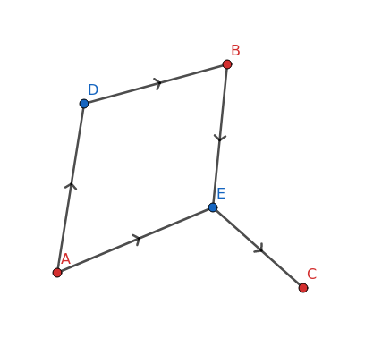
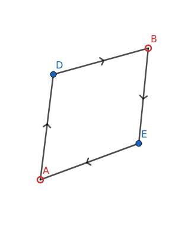

# Scrape Graphs

In scraping the web, we can often use data we already have to discover new data. For example, if we know the id of a user, and we know how to retrieve their username with said id, then it is possible for us to discover their username with the information we have.

This concept can generalise. We have a set of data points $D$ and a set of scrapes $S$, such that for all $s \in S$, $s = (X, Y)$ where $X, Y \subseteq D$. Here, $X$ represents the data required for us to be able to scrape the data in $Y$.

## Converting to a graph

We want to model this as a graph, so that we may abuse graph traversal algorithms to determine whether an arbitrary node $d \in D$ is possible to retrieve, given a set $C \subseteq D$ of data points we currently already have.

We may do this by defining the graph as $(N, E)$, where the nodes $N = D \cup S$, and where, rather convolutedly, the edges $E = \bigcup_{(X,Y) \in S} [ \bigcup_{x \in X} (x,(X,Y)) \cup \bigcup_{y \in Y} ((X,Y),y) ]$. We may interpret this as for each scrape in $S$, we create a node in the graph for it along with the data points $D$, and create a directed edge from $d \in D$ to $s \in S$ if $d$ is required for $s$ to occur, and from $s$ to $d$ if $s$ retrieves $d$.

If we have $D = \{ a, b, c \}$ and $(\{a\},\{b\}),(\{a,b\},\{c\}) \in S$, (i.e. we can retrieve $b$ with $a$, and $c$ with $a$ and $b$), then this gives us the following graph: 

<p align="center"></p>

Here, we colour data points in $D$ with red, and scrapes in $S$ with blue. We can observe that any two nodes in $N$ can only be adjacent if one is in $D$ and the other is in $S$, i.e. one is red and the other blue.

**NB**: We define $m$ to be a parent of $n$ if $(m,n) \in E$. Likewise, $n$ is a child of $m$.

## Defining Possibility

Here we meet two subsets of $N$. $C \subseteq N$ we have met before, and it represents the data in $D$ we have already retrieved. We now also define $P \subseteq N$, which represents the set of data in $D$ which it is possible to retrieve by some arbitrary ordering of scrapes, as well as the set of scrapes in $S$ which can be successfully performed to do so.

We can make some observations given this definition.

1. $C \subseteq P$

If $d \in C$, then it already exists, so we may retrieve it trivially by performing no scrapes. So $d \in P$.

2. If $d \in D \setminus C$, then $d \in P$ if and only if $\exist (X,Y) \in P \cap S, d \in Y$.

If a point $d \in D$ does not currently exist, it is only possible to retrieve if there exists some scrape $s \in S$ which is both possible to perform, and retrieves $d$.

3. If $(X,Y) \in S$, then $(X,Y) \in P$ if and only if $X \subseteq P$.
  
This states that for a scrape to be possible given $C$, all of it's parents $x \in X$ must likewise be possible to retrieve.

## Static Scrape Graphs

Before we can define an algorithm that returns whether $d \in P$ for some $d \in D$, we must first define a *static scrape graph*. A static scrape graph is a graph such that the information encoded behind a data point $d \in D$ cannot be changed. This becomes relevant as, given the example of web scraping, we may want to alter the data in some database, or it may passively alter itself over time. Given this, we have to be conscious of assumptions we may make in developing an algorithm for determining possibility in any arbitrary scraping process.

## Determing the possibility of a Static Scrape Graph

### IsPossible()

This algorithm *may* determine, given an arbitrary node $n \in N$, and the set of currently existing data points $C$, whether $n \in P$, i.e. whether $n$ is possible. We can apply the three observations made about possibility earlier.

```
Input: n, we assume C, D, S, N are known.
Output: Whether n ∈ P. 

isPossible(n) {
    
    if (n ∈ C) return true; // 1., C ⊆ P
    else if (n ∈ D) { // n ∈ D \ C

        // 2.
        // all s impossible <=> n impossible
        for (s ∈ { (X,Y) ∈ S : n ∈ Y }) { 
            if (isPossible(s)) return true;
        }
        return false;

    } else { // n ∈ S

        // 2.
        let (X,Y) = n
        // all d ∈ X possible <=> n is possible
        for (d ∈ X) {  
            if (!isPossible(d)) return false;
        }
        return true;

    }

}
```

There are, however, cases where this algorithm will not terminate. Take the following as an example.

<p align="center"></p>

Here, the hollow circles A and B represent the fact that $A, B \notin C$. If we attempt to determine `isPossible(A)`, as $A \notin C$, the algorithm will attempt to check `isPossible(E)`, followed by `isPossible(B)`, `isPossible(D)`, and finally `isPossible(A)` recursively. The state in the first and second call to `isPossible(A)` is exactly the same, so this algorithm will recurse indefinitely, therefore never terminating.

We want to avoid this. We can do so by taking inspiration from a depth-first-search, and decorate nodes based on whether we've yet to meet them (white), whether we're currently determining their possibility (grey), or whether we've finished doing so (black).

```
Input: Same as last time, with an added map 
Output: Whether n ∈ P.

isPossibleHelper(n, PossibleMap, Colour) = {

    // if a cycle is found, this route is not possible to scrape
    if (Colour(n) == Grey) return false; 

    // already determined, need not recurse
    else if (Colour(n) == Black) return PossibleMap(n)
 
    // else Colour(n) == White
    Colour.set(n, Grey);

    let original = {

        if (n ∈ C) return true; // 1., C ⊆ P
        else if (n ∈ D) { // n ∈ D \ C

            // 2.
            // all s impossible <=> n impossible
            for (s ∈ { (X,Y) ∈ S : n ∈ Y }) { 
                if (isPossibleHelper(s, PossibleMap, Colour)) return true;
            }
            return false;

        } else { // n ∈ S

            // 2.
            let (X,Y) = n;
            // all d ∈ X possible <=> n is possible
            for (d ∈ X) {  
                if (!isPossibleHelper(d, PossibleMap, Colour)) return false;
            }
            return true;

        }

    }

    PossibleMap.set(n, original);
    Colour.set(n, Black);

    return original;

}

isPossible(n) = {
    
    define map Colour: N |-> Colour;
    define map PossibleMap: N |-> Boolean;
    return isPossibleHelper(n, PossibleMap, Colour)

}
```
Note that we create a store of already determined possibility values `PossibleMap`. This is very similar to a dynamic programming algorithm, as once a sub-problem is determined, we need not reevaluate it.

If at any point in the recursion we meet a grey node, then this is a back edge, therefore creating a cycle. We define a grey node to be impossible to determine at this point, so return `false`. However, this is not the final state of this node, so we do not alter `PossibleMap`.

If the node is white, we have not met it before, so are justified in running the original algorithm.

Given the algorithm traverses each edge at most once, the function `isPossibleHelper` is recursed $O(|E|)$ times. At each instance of `isPossibleHelper`, there is further iteration done aside from recursing down the tree, so the entire algorithm has complexity $O(|E|)$. We also require $O(|N|)$ memory, as the maps `PossibleMap` and `Colour` each represent `N` relations. Given `PossibleMap(n) = true` iff `Colour(n) = black`, we do not need two separate maps, but I have represented it as such for ease of readability.

We now have an algorithm that recieves an arbitrary $d \in D$ and returns whether $d \in P$. We must notice, however, that to do so, we have determined the possibility of many other nodes in the graph. Is it possible to do so for all nodes in the graph, so that we only need to run the algorithm once?

### FloodPossibility()

We must make some observations before we can implement such an algorithm.

1. If $\forall (X,Y) \in S, X \neq \empty$, and $C = \empty$, then $P = \empty$. 
   
This says that if we do not have any existing data points, then we can not determine any more. The natural exception to this rule is whether there exists a scrape that can be made without any existing data.

2. The possibility state of a node $n \in N$ only changes if that of one of it's parents also changes.
   
If $n \in (D \setminus C) \cup S = N \setminus C$, then by observations 2 and 3, we see that the possibility of $n$ is determined by that of it's parents. If $n \in C$, then it's state does not change, as $C \subseteq P$, and once $n \in C$, as we are currently only considering Static Scrape Graphs, it does not leave $C$ (note this for the future).

Furthermore, if a node is possible before a new element is introduced to $C$, then it will remain possible afterwards.

So we may begin from the nodes which already exist, and flood the tree down the directed graph to determine which nodes are possible, and which are not.

The way we may implement this is as such. If we already know a certain $P$ for a corresponding $C$, then we can determine $P_0$ from $C_0 = C \cup \{n\}$ where $n \in N \setminus C$. 

```
Input: n, C, P
Output: None

This algorithm will add nodes to P as a procedure.

- First, add n to C and P, then run FloodPossibility(n).

FloodPossibility(n) {

    if (n ∈ S) {
        // for all children
        let (X,Y) = n;
        for (d ∈ Y) { // these are all now possible
            if (d !∈ P) {
                P.add(d);
                FloodPossibility(d);
            }
        }
    } else { // n ∈ D
        // for all children
        for ((X,Y) ∈ { (X,Y) ∈ S : n ∈ X }) {
            if ((X,Y) !∈ P and X ⊆ P) { // these are now possible
                P.add((X,Y));
                FloodPossibility((X,Y));
            }
        }
    }

}
```

`FloodPossibility` takes in a newly possible node, and checks whether any of it's children are now possible, recursing down if they are.

If the overall input `n` was already possible, the algorithm need not be run, as the state of P will not change.

We first initialise our store for $P$ by iterating through all $s \in S$, and if any $s$ have no parents, then they are possible by the given definition, so we may add them to $P$ and execute `FloodPossibility(s)`.
We then iterate through $C$, applying `FloodPossibility` to all $d \in C$. 

An added benefit to this algorithm is that when new data points are scraped, we can use the same algorithm to update $P$.

As, similar to `IsPossible`, we traverse every edge only once, the time complexity is $O(|E|)$. However, assuming we eventually want to make all nodes possible, we will only ever traverse down every edge once, so for a given StatiFc Scrape Graph, the total sum of the time complexity of all necessary executions of `FloodPossibility` is $\Theta(|N| + |E|)$. This is a definite improvement over `IsPossible`.


